<h1 align="center">Grant Glass, Ph.D.</h1>

  <strong>Senior Applied &amp; Data Scientist @ NetApp</strong>&nbsp;·&nbsp;AI Governance &amp; Safety Educator&nbsp;·&nbsp;Researcher

  I build production AI systems — and teach the people who govern them. 
  RAG, agentic frameworks, and responsible-AI evaluation.

  <a href="https://glassgrant.com">Website</a>&nbsp;·&nbsp;
  <a href="https://orcid.org/0000-0003-3867-1494">ORCID</a>&nbsp;·&nbsp;
  <a href="mailto:grantg@unc.edu">Email</a>

---

### 👋 About

I'm an applied AI scientist working at the intersection of **production machine learning** and **AI safety, governance, and ethics**.

At **NetApp**, I built the company's first customer-facing **Retrieval-Augmented Generation (RAG)** system and lead internal AI initiatives in **security and governance** for enterprise storage products. Alongside that, I teach graduate courses on **responsible AI, agentic frameworks, and the ethics of data science** at **NC State** and **UNC–Chapel Hill**, and I'm writing a book on AI and culture for **Bloomsbury Academic**.

My background is deliberately interdisciplinary: a Ph.D. in the humanities alongside hands-on ML engineering. I ship models *and* reason rigorously about their failure modes, fairness, and societal impact.

### 🔭 Focus areas

- **Applied AI / LLMs** — RAG pipelines, agentic systems, prompt engineering, production deployment
- **AI safety & governance** — responsible-AI frameworks (NIST AI RMF, EU AI Act), bias & fairness audits, model cards, human oversight
- **LLM evaluation** — measuring quality, safety, and hallucination in model outputs
- **ML for research** — NLP, computer vision, and network analysis over large cultural datasets

### 📌 Selected projects

| Project | What it is |
| --- | --- |
| [**data-advanced-ai**](https://github.com/Grantglass/data-advanced-ai) | A full graduate course (MBA 590) on advanced AI strategy — prompting, RAG, agentic & multi-agent systems, LLM evaluation, and AI governance, with runnable notebooks. |
| [**An-Adaptive-Methodology**](https://github.com/Grantglass/An-Adaptive-Methodology) | A machine-learning method for detecting literary adaptation at scale, from my dissertation (presented at Digital Humanities 2022, Tokyo). |
| [**gitarchaeology**](https://github.com/Grantglass/gitarchaeology) | Research on survivorship bias in open datasets and how to build reproducible, historically faithful research corpora. |
| [**intro_to_ml**](https://github.com/Grantglass/intro_to_ml) | "Machine Learning for Humanists" — a hands-on introduction to ML I developed for the TAP Institute. |
| [**social-media-workshop**](https://github.com/Grantglass/social-media-workshop) | Methods and materials for computational social-media research in Python (DHSI workshop). |

### 🛠️ Skills & tools

**Languages:** Python · SQL · Bash
**AI / ML:** LLMs · RAG · agentic frameworks · NLP · prompt engineering · scikit-learn · GANs · model evaluation
**Platforms:** Azure AI · AWS · Docker · Jupyter · Git
**Governance:** NIST AI RMF · EU AI Act · bias & fairness audits · model cards

Microsoft Certified: Azure AI Engineer Associate

### ✍️ Writing & research

- 📖 *Literary Culture in the Age of AI: Agents of the Algorithm* — Bloomsbury Academic (under contract)
- 📄 "Visions in the Machine: Automated Tagging of the William Blake Archive" — *Digital Humanities Quarterly* (2026)
- 📑 "Enhancing RAG Systems: Lessons from Doc Development at NetApp" — NetApp white paper (2024)
- 🔗 [On the Books: Jim Crow and Algorithms of Resistance](https://onthebooks.lib.unc.edu) — machine learning applied to historical legal text

### 📫 Connect

<a href="https://glassgrant.com">glassgrant.com</a>&nbsp;·&nbsp;<a href="https://orcid.org/0000-0003-3867-1494">ORCID</a>&nbsp;·&nbsp;grantg@unc.edu

---

  

